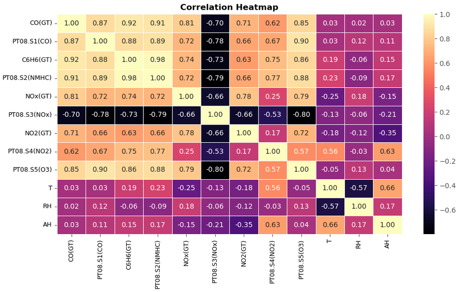
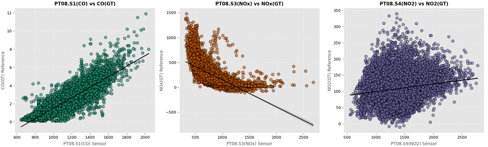
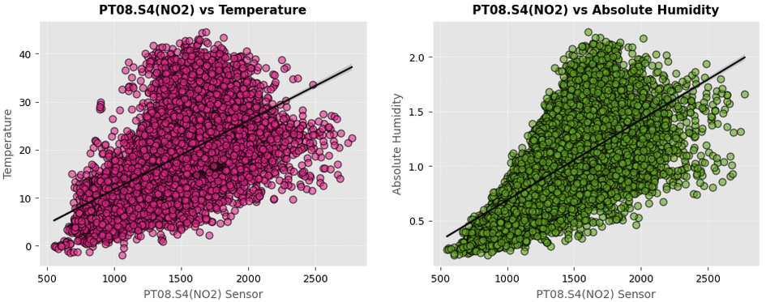
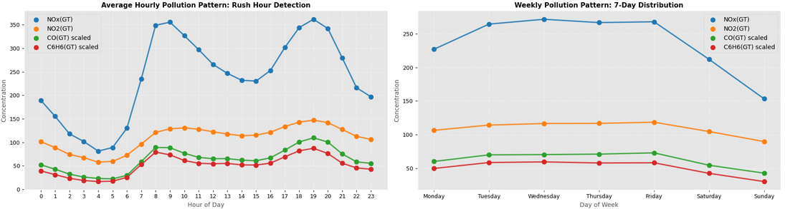
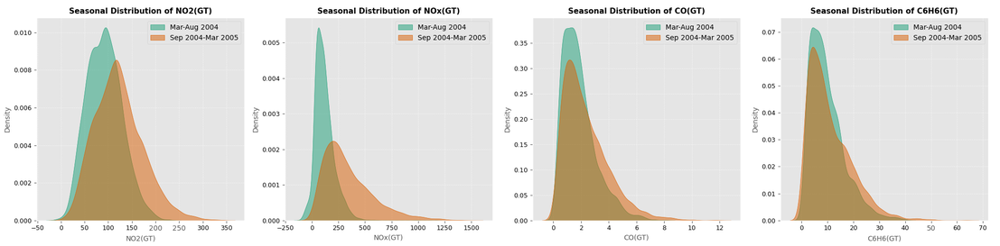
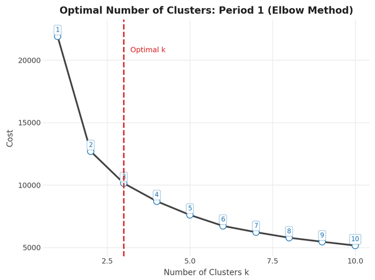
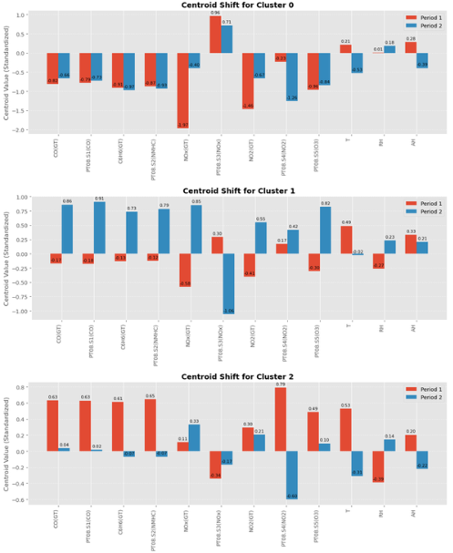
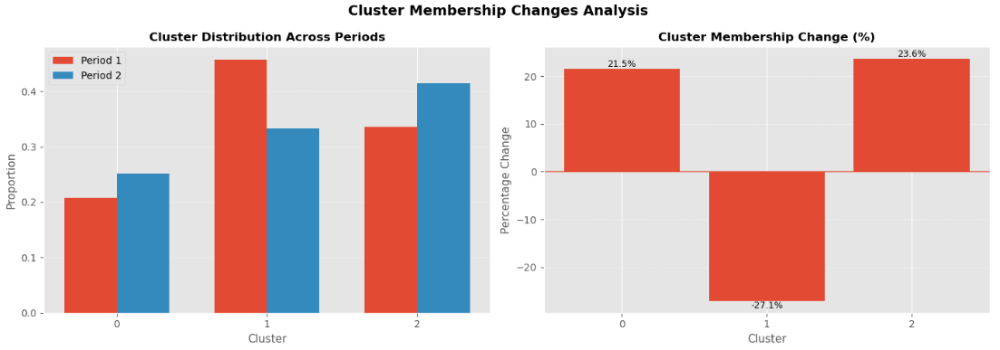
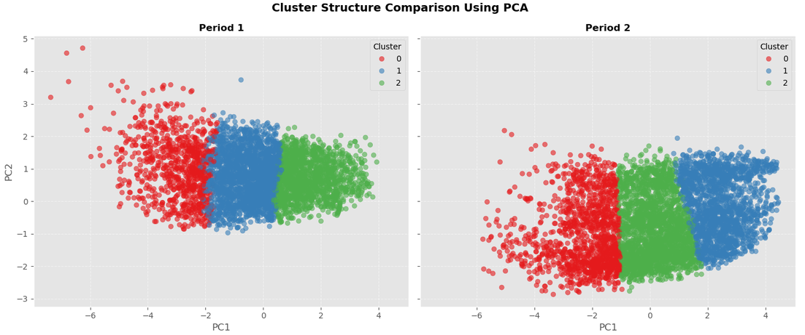

> **Note:** GitHub often fails to render large Jupyter Notebooks. To view the full project with all plots and training results, please use the DagsHub link below:
>
> 

# Temporal Dynamics of Urban Air Quality: A Two-Phase Clustering and Drift Analysis

## Executive Summary

This project analyses a year of hourly air quality sensor data from an Italian city to understand how urban pollution patterns evolve between the warmer and colder seasons, and whether a clustering model trained on one period remains valid for another. Using K-Means clustering, three consistent air quality states — **Low, Moderate, and High Pollution** — were identified for **March–August 2004 (Period 1)** and **September 2004–March 2005 (Period 2)**. Centroid shifts, cluster membership changes, and KL divergence were then used to quantify **model drift** between the two periods, with PCA used to visualise the structural changes.

## Project Objectives

- Perform exploratory data analysis to understand pollutant relationships and detect anomalies
- Detect and treat numerical outliers in sensor and reference gas readings
- Apply feature scaling and transformation for consistency across variables
- Develop K-Means clustering models independently for Period 1 (Mar–Aug 2004) and Period 2 (Sep 2004–Mar 2005), optimizing the number of clusters
- Evaluate clustering performance using internal validation metrics
- Quantify model drift between periods via centroid shifts, cluster membership changes, and KL Divergence
- Visualise cluster structure and drift using PCA
- Link cluster variation to environmental and socio-economic trends

## Overview of the Data

The dataset contains **9,358 hourly recordings** from a multisensor device positioned at ground level in an urban area in Italy (March 2004–March 2005). It includes:

- **Five metal-oxide chemical sensors** — PT08.S1(CO), PT08.S2(NMHC), PT08.S3(NOx), PT08.S4(NO2), PT08.S5(O3)
- **Reference pollutant concentrations** — CO(GT), NOx(GT), NO2(GT), C6H6(GT), NMHC(GT)
- **Environmental factors** — Temperature (T), Relative Humidity (RH), Absolute Humidity (AH)

**Data cleaning:**
- Missing values (encoded as -200) were converted to NaN.
- `NMHC(GT)` was missing over 90% of its data and was dropped entirely.
- The remaining sensor and reference columns (~3.9% missing) were treated with iterative/linear interpolation.

## Exploratory Data Analysis

- **Correlation structure:** reference gases are strongly inter-correlated (CO(GT) ↔ C6H6(GT) = 0.92, CO(GT) ↔ NOx(GT) = 0.81, NOx(GT) ↔ NO2(GT) = 0.78), consistent with a shared traffic-combustion source. Sensor–reference alignment varies: PT08.S1(CO) tracks CO(GT) strongly, PT08.S3(NOx) shows only a moderate (negative) relationship with NOx(GT), and PT08.S4(NO2) is weakly related to NO2(GT), with clear environmental bias from temperature and humidity.

- **Hourly pollution pattern:** two clear rush-hour peaks — **~7–9 AM** and **~6–9 PM** — coinciding with vehicle activity, visible consistently across NOx(GT), NO2(GT), CO(GT), and C6H6(GT).
- **Seasonal distributions:** all four reference gases show a rightward shift in Sep 2004–Mar 2005 versus Mar–Aug 2004, indicating higher and more volatile winter pollution; combustion-related gases (NO2, NOx) show the most dramatic seasonal spread.

- **Feature distributions:** the reference gases are right-skewed with high-end outliers, largely reflecting real pollution events (heavy traffic, stagnant weather) rather than data errors.

## Outlier Detection and Removal

High-end outliers in the reference pollutants and sensor responses were treated using **Winsorization (IQR-based capping)** rather than removal, preserving the extreme-but-real pollution events while limiting their influence on downstream scaling and clustering.

## Feature Scaling and Transformation

- **Log transformation** was applied to the right-skewed reference gases and sensor variables after Winsorization, to further reduce skew and stabilize variance.
- **RobustScaler** (median/IQR-based) was used for final feature scaling, chosen over StandardScaler for its robustness to residual outliers.

## Clustering Model Development

- K-Means was fit separately for **Period 1 (Mar–Aug 2004)** and **Period 2 (Sep 2004–Mar 2005)** on the cleaned, transformed, and scaled feature set.
- The optimal number of clusters, **k = 3**, was selected via the Elbow Method on Period 1 and applied consistently to Period 2 to enable direct comparison across periods.
- The resulting three clusters were interpreted as **Low Pollution**, **Moderate Conditions**, and **High Pollution** states.

## Cluster Evaluation

| Metric | Period 1 | Period 2 |
|---|---|---|
| Silhouette Score | 0.2558 | 0.2676 |
| Davies–Bouldin Index | ~1.27 | ~1.27 |
| Calinski–Harabasz Score | 2,420 | 3,296 |

Silhouette scores indicate weak but meaningful separation, expected for continuously varying pollutant data rather than naturally distinct groups. Davies–Bouldin values show stable compactness/separation across periods, while the rise in Calinski–Harabasz score suggests improved cluster distinctness in Period 2.

## Model Drift Analysis

Since K-Means cluster labels are not guaranteed to be consistent across independent runs, clusters from Period 1 and Period 2 were first **aligned by minimum centroid distance** before comparison.

**Centroid shifts:**
- **Cluster 0 (High Pollution):** NOx(GT) (+1.57) and NO2(GT) (+0.80) rise sharply in Period 2, alongside a slight CO increase, while temperature (-0.74) and absolute humidity (-0.67) fall — consistent with colder, drier conditions that reduce dispersion and promote accumulation.
- **Cluster 1 (Moderate Conditions):** moderate increases in CO, benzene, and PT08 sensor readings, with temperature down (-0.80) and relative humidity up (+0.41), indicating a drift toward more variable, slightly more polluted conditions.
- **Cluster 2 (Low Pollution):** smaller pollutant increases but higher relative (+0.62) and absolute humidity, showing that even the "cleanest" state becomes less stable in winter.

**Cluster membership changes:**
- Cluster 1 (Moderate) fell **-27.1%**
- Cluster 0 (High Pollution) rose **+21.5%**
- Cluster 2 (Low Pollution) rose **+23.6%**

This shows a redistribution away from stable moderate conditions toward more extreme low- and high-pollution states.

**KL Divergence:** 0.0329 — a low value indicating the overall cluster distribution is broadly similar between periods, even though membership shifted substantially at the individual-cluster level. This points to **moderate, localized drift** rather than a wholesale change in structure.

## Visualization of Results (PCA)

PCA reduced the 12-dimensional feature space to two principal components for visual comparison of the two periods:

- **Horizontal (PC1) shift:** the data distribution moves rightward from Period 1 to Period 2, indicating a change in baseline atmospheric conditions with season.
- **Expansion of the High-Pollution cluster:** Cluster 0 is compact in Period 1 but expands and moves toward the center in Period 2, reflecting more frequent and widespread high-pollution events.
- **Change in cluster dominance:** Cluster 1 dominates the central region in Period 1, but Cluster 2 expands into that space in Period 2 — evidence that cluster boundaries are not stable across seasons.

## Conclusion and Insights

- Three consistent air quality states (Low, Moderate, High Pollution) were identified in both periods, but their underlying characteristics shifted between seasons — pollutant-dominant clusters intensified in colder months as temperature and humidity fell.
- Cluster membership redistributed from moderate conditions toward more extreme (low and high) states, while KL divergence stayed low — indicating **moderate model drift**: the global structure held, but the internal balance changed meaningfully.
- **Socio-economic and environmental links:** higher winter pollution aligns with increased heating demand and atmospheric inversion; seasonal shifts in traffic and industrial activity reinforce the emission-intensity changes seen in the clusters; the rise in high-pollution periods during colder months underscores the case for targeted interventions such as traffic regulation and industrial emission controls.
- Overall, urban air quality is highly dynamic and seasonally dependent — a single static clustering model is unlikely to generalise well across seasons, supporting the case for **period-specific or periodically retrained models** in environmental monitoring systems.

## Tech Stack

- **Programming:** Python
- **Libraries:** pandas, numpy, scikit-learn (KMeans, PCA, RobustScaler, IterativeImputer), scipy (KL divergence via `entropy`), matplotlib, seaborn, plotnine (ggplot)
- **Techniques:** Winsorization, log transformation, robust scaling, K-Means clustering, Silhouette/Davies–Bouldin/Calinski–Harabasz evaluation, centroid-shift and cluster-membership drift analysis, KL Divergence, PCA
